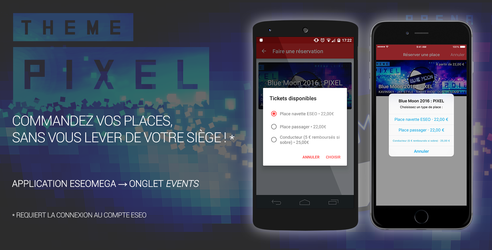

# Bureau des Étudiants du Groupe ESEO

Télécharger : [App Store](https://itunes.apple.com/app/apple-store/id966385182?pt=104224803&ct=GitHub&mt=8) &nbsp;·&nbsp; Site : [eseomega.fr](http://eseomega.fr) &nbsp;·&nbsp; Portail Clubs : [portail.eseomega.fr](http://portail.eseomega.fr)

 
###### Image [François Leparoux](https://github.com/rascafr)

## Description

> Découvrez l’application du Bureau des Étudiants du Groupe ESEO !
> 
> Tout au long de l'année, profitez de toute la vie associative de l'ESEO en un seul endroit.
> 
> NEWS
> - Toute l'actualité de l'ESEO en un seul endroit, accédez facilement à la newsletter du dimanche
> - Les notifications vous permettent de ne rien manquer !
> - Accédez aux éditions du journal Ingénews
> 
> EVENTS
> - Retrouvez le calendrier annuel des événements de la vie associative
> - Inscrivez-vous aux événements et commandez vos places, notamment pour la Blue Moon !
> 
> BDE & CLUBS
> - Les infos, les photos, les liens, les contacts pour le BDE ainsi que tous les clubs de l'ESEO. 
> L'occasion rêvée de découvrir de nouveaux clubs et d'en rejoindre !
> 
> CAFÉTÉRIA
> - La cafétéria se modernise ! Désormais, commandez avec votre smartphone votre déjeuner !
> - Visualisez votre historique de commandes et soyez informés, sans bouger, lorsque votre commande est prête par une notification
> - Payez en liquide ou en carte bleue
> 
> BONS PLANS
> - Grâce à nos sponsors, profitez de multiples bons plans étudiants
>
> PRATIQUE
> - Remontez l'arbre des parrainages étudiants !
> - Consultez le plan du campus à Angers
> - Retrouvez également tous les liens vers le portail, campus, mails, …
> 
> Disponible sur iPhone & iPad 
> Créée par SheepDevs 
> Ω

## Licence

    Copyright © 2015-2016 Thomas NAUDET

    This program is free software: you can redistribute it and/or modify
    it under the terms of the GNU General Public License as published by
    the Free Software Foundation, either version 3 of the License, or
    (at your option) any later version.

    This program is distributed in the hope that it will be useful,
    but WITHOUT ANY WARRANTY; without even the implied warranty of
    MERCHANTABILITY or FITNESS FOR A PARTICULAR PURPOSE.  See the
    GNU General Public License for more details.

    You should have received a copy of the GNU General Public License
    along with this program. If not, see http://www.gnu.org/licenses/

## Informations techniques

Nécessite une API Serveur SheepDevs et/ou ESEOasis pour fonctionner.

## TODO
- Généraliser les achats de place (« navette »)
- Lors d'une commande, barre Carte/Panier de mauvaise taille en Split View iPad ou lors d'un appel/hotspot
- Fausse déconnexion lors de l’ajout d’une photo après une réinstallation
- iOS 9/10 SFSafariViewController animation étrange si pop-up, barre étrange lors d'un appel/hotspot
- Continuer à simplifier le code (réécriture en Swift) et commenter

## Versions
###v4.1 · ?/02/2017
> - Nouvelle connexion au compte ESEO avec l'adresse mail
> - Interface de connexion améliorée et possibilité de rogner un avatar

###v4.0.3 · 03/01/2017
> - Correctifs pour iPhone 7/7+, Ingénews et la cafet […]

###v4.0.2 · 29/11/2016
> - Correctifs pour les news, events et autres… […]

###v4.0.1 · 21/11/2016
> - Correctifs pour les news et autres… […]

###v4.0 · 15/11/2016
> Non ce n'est pas un mirage… 
> l'app a changé de logo !
> 
> Nouveau avec ESEOasis :
> - Interface aux couleurs du club du désert
> - Arbre des parrainages à l'ESEO : recherchez votre nom et trouvez votre famille !
> - Possibilité de s'inscrire à un événement
> - Aperçu des news et événements liés à chaque club
> - Récupération des données désormais depuis le serveur ESEOasis et mise à jour des liens
> 
> Également dans cette version :
> - Nouveau son pour les notifications
> - Retour haptique sur iPhone 7/7+ validant un ajout au panier
> - Trouvez une salle en quelques secondes par un appui 3D Touch sur l'icône de l'app. Nouveaux tris par bâtiment et par étage.
> - Ajout facilité d'un club/BDE en ami Snapchat
> - Les événements les plus récents apparaissent maintenant en haut
> - Améliorations de l'affichage des sponsors et infos événements
> - Perfection de multiples détails d'interface
> 
> Partagez l'app et n'oubliez pas de la noter sur l'App Store ! 
> Une question ? Un problème ? Contactez Thomas Naudet sur Facebook

###v3.2 · 02/10/2016

> Mise à jour corrective de rentrée
> 
> Support d'iOS 10 : 
> – Envoie des stickers de la Vie Asso. dans tes iMessages ! 
> – Notifications enrichies (titre, images, GIF), in-app et interactives 
> – Améliorations de l'interface & couleurs
> 
> – Correction du message de paiement via Lydia
> 
> Partagez l'app et n'oubliez pas de la noter sur l'App Store ! 
> Une question, ou vous voulez proposer un sticker ? Contactez Thomas Naudet sur Facebook

###v3.1.6 · 05/06/2016
> Amélioration et correction des achats cafet, événements et Lydia […]

###v3.1.5 · 02/06/2016
> Merci d'avoir utilisé l'app pendant notre mandat ESEOmega ! 
> Ω 
> Mais ce n'est pas fini… 
> Utilisez-la pour ESEOasis et les futurs BDE !
> 
> – Généralisation de l'app 
> – Ajout d'un lien rapide vers Microsoft Dreamspark 
> – Copyright photo bâtiment 
> – Corrections push, cafet et UI
> 
> N'oubliez pas de noter l'app sur l'App Store !

###v3.1.4 · 25/03/2016
> – Retour sur iOS 8.1 pour les old school […]

###v3.1.3 · 17/03/2016
> – Correction des notifications, suite et fin […]

###v3.1.2 · 11/03/2016
> – Correction des notifications internes à l'app 
> – Rafraîchissement des pages plus rapide
> […]

###v3.1.1 · 06/03/2016
> – Correction des notifications internes à l'app […]

###v3.1 · 03/03/2016
> La touche finale de votre app BDE ESEO :
> 
> – Passage en HTTPS et sur les nouvelles API ESEOmega · SheepDev 
> – Chargement dynamique de l'intégralité des données pour évolutivité… 
> – Ajout d'un lien vers le nouveau portail clubs ESEOmega.fr/portail 
> – Correction d'un rare bug lors d'une commande, empêchant de sélectionner un menu 
> – GP danse en musique 
> – Améliorations d'interface, crashes chassés
> 
> Et toujours avec la 3.0, payez par carte à la cafet, lisez les IngéNews, accédez au plan des salles, … 
> Ω

###v3.0 · 19/01/2016

> Méga mise à jour pour bien commencer la nouvelle année 2016 !
> 
> – Payez par carte à la cafet ! 
> Ce n'est pas parce que votre porte-monnaie est vide que votre estomac doit l'être aussi ! 
> Au moment de votre commande vous pouvez désormais choisir de payer par carte bancaire sans frais supplémentaires, grâce à Lydia.
> 
> – Une Carte Bleue pour la Blue Moon 
> Achetez votre place pour la Blue Moon depuis l'application ! Par CB, c'est tellement simple, tout est dans l'onglet Événements.
> 
> – Lisez les articles Ingénews 
> Depuis l'onglet News, tapez sur le logo du club pour avoir les dernières éditions du journal de l'ESEO !
> 
> – « On a cours où, déjà ? » 
> Un nouveau bouton est apparu quand vous lancez l'application, tapotez-le doucement et il vous indiquera gentiment la liste des salles de l'ESEO Angers. Vraiment perdu ? Vous pouvez même consulter les plans.
> 
> – Indication du club/BDE servant à la cafet la semaine 
> – Amélioration du processus de commande et de l'affichage 
> – Restructuration de tous les services en ligne 
> – Corrections diverses et variées
> 
> N'oubliez pas de noter l'app sur l'App Store ! 
> Ω

###v2.1.2 · 06/11/2015
> – 3D Touch corrigé pour les iPhone 6s (Plus) 
> [Excusez le développeur en lui en offrant un qu'il puisse mieux effectuer ses tests] 
> Sur l'écran d'accueil, appuyez fortement l'icône ESEOmega pour accéder aux raccourcis : 
> commandes par exemple votre sandwich ou accédez au portail ESEO en 1 seconde ! 
> Prévisualisez également toutes les contenus avec Peek et Pop (appui ± fort).
> 
> – Correction de l'ouverture des articles depuis un Rappel créé avec Siri 
> (Dites à Siri : « Rappelle-moi de lire ça plus tard » n'importe où dans l'app)
> 
> – Bonus pour la route : 
> Ouvrez les news dans Safari depuis le menu partage.
> 
> Consultez l'Historique des mises à jour pour en savoir plus sur les précédents ajouts (notifications, navigateur Safari intégré & économie de batterie iOS 9, Siri, transfert de lecture Handoff entre appareils iOS/Mac, 3D Touch, multitâche iPad, recherche Spotlight, zoom sur les images de club en tapant sur la description, améliorations cafet, …).
> 
> N'oubliez pas de noter l'app sur l'App Store ! 
> Ω

###v2.1.1 · 04/11/2015

> Après les Notifications et l'optimisation iOS 9, quelques autres nouveautés pour l'app ESEOmega :
> 
> – 3D Touch 
> Sur l'écran d'accueil de votre iPhone 6s (Plus), appuyez fortement sur l'icône ESEOmega pour accéder aux raccourcis ! 
> Lancer la commande de son sandwich en 1 seconde sans ouvrir l'app, c'est possible ! 
> Prévisualisez également les News, les liens dans les news, les Évenements, Clubs, Liens rapides, Bons plans et vos Commandes en appuyant légèrement dessus (Peek), et pressez un peu plus fort pour les afficher en plein écran (Pop) !
> 
> – Tapez sur la description d'un club pour afficher son image en plein écran 
> – Correction des problèmes de connexion au profil ESEO et des notifications pour certains utilisateurs 
> ¯\\_(ツ)_/¯
> 
> – Prise en charge d'Handoff : lisez un article sur votre iPhone et finissez-le sur votre Mac, et inversement 
> – Dites à Siri : « Rappelle-moi de lire ça plus tard », si vous n'avez pas le temps de lire une news (ou autre) tout de suite ! 
> – Retrouvez les news et les fonctionnalités de l'app depuis la recherche Spotlight iOS 9 
> – Multitâche sur iPad : avec Split View, Slide Over et les vidéos Picture in Picture, utilisez ESEOmega en même temps qu'une autre app ! 
> – Détection des liens dans les news, prise en charge des vidéos intégrées, amélioration diverses…
> 
> N'oubliez pas de noter l'app sur l'App Store !
> 
> Ω

###v2.1 · 15/10/2015
> Hermès livre encore pléthore d'améliorations après la méga mise à jour de rentrée…
> 
> NOTIFICATIONS 
> — Plus besoin de garder l'app ouverte pour ne pas manquer les dernières news 
> — Plus pratique ! Vous pouvez venir cherche votre repas et payer après qu'il soit prêt en étant prévenu par une notification
> 
> N'hésitez donc pas à vous connecter dans l'app grâce à votre compte ESEO pour accéder à la cafet et aux notifications !
> 
> iOS 9 INSIDE 
> — Ouvrez les liens sans quitter l'app avec le navigateur Safari intégré 
> — Optimisations en mode économie d'énergie et réduction du poids de l'app
> 
> MAIS AUSSI 
> — Possibilité d'ajouter des commentaires à sa commande cafet 
> — Nouvelle barre rapide d'ajout au panier cafet 
> — Affichage de la date de fin et diverses améliorations pour les événements 
> — Correction des liens rapides pour nous contacter 
> — News plus rapides à charger, correction du style 
> — Ajout des comptes Instagram pour les clubs 
> — 100aine de petites améliorations de l'affichage partout 
> — Passage à la Guyllotine 
> — Correction de bugs et sécurité renforcée (© Romain H.)
> 
> N'oubliez pas de noter l'app sur l'App Store !
> 
> Ω

###v2.0 · 02/09/2015

> Nouvelle année scolaire, place à une toute nouvelle application !
> 
> NEWS 
> → Toute l'actualité de l'ESEO en un seul endroit, accédez facilement à la newsletter du dimanche 
> 
> EVENTS 
> → Retrouvez le calendrier annuel des événements de la vie associative 
> 
> BDE & CLUBS 
> → Les infos, les liens, les contacts pour le BDE ainsi que tous les clubs de l'ESEO. 
> L'occasion rêvée de découvrir de nouveaux clubs et d'en rejoindre !
> 
> CAFÉTÉRIA 
> → La cafétéria se modernise ! Désormais, commandez avec votre smartphone votre déjeuner ! 
> Visualisez votre historique de commandes et soyez informés lorsque votre commande est prête.
> 
> BONS PLANS 
> → Grâce à nos sponsors, profitez de multiples bons plans étudiants
> 
> Retrouvez également tous les liens vers le portail, campus, mails, … 
> Maintenant disponible sur iPad.
> 
> ESEOmega vous souhaite une bonne rentrée ! 
> Ω

###v1.1 · 15/04/2015
> Merci à tous ! 
> On vous réserve une super année 2015/2016 !
> 
> Bientôt des nouveautés, Hermès a livré quelques améliorations pour patienter : 
> › rajout de toutes les vidéos dont l'aftermovie rallye appart ! 
> › l'app s'offre une cure de minceur puissance 4 
> › économie également pour votre forfait 
> › Hadès ne vous envoie plus en enfer d'un tap sur Animations, si vous n'aviez pas mis à jour votre iPhone 
> › Rodolphe retrouve son T 
> › correction des crédits 
> Nous remercions tous nos sponsors !

###v1.0 · 29/03/2015
> *Publication originale pour la campagne ESEOmega*
> 
> *[Voir l'app de campagne](https://github.com/Tomn94/Campagne-ESEOmega)*
